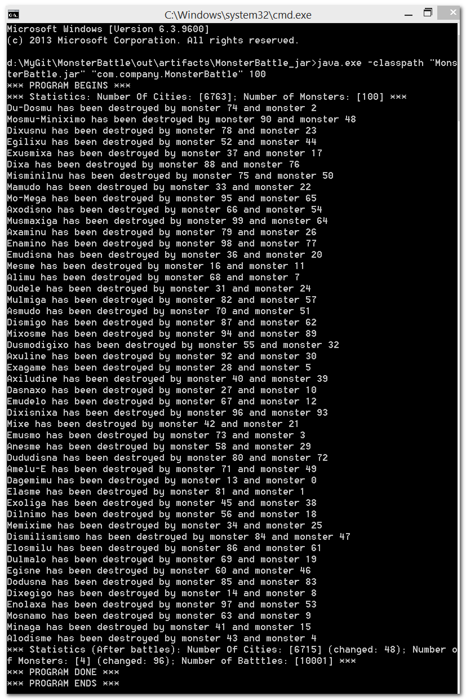

# Monster Battle
A little game of monsters moving randomly in an imaginable world, fighting each other to death whenever encountering, ruining the cities where they fought.

There are two ways to reproduce:

* By Intellij: Open the project (*.iml). Then Run.

* By Command Line: java.exe -classpath "MonsterBattle.jar" "com.company.MonsterBattle" 100

Note: In case those additional jars cannot be found, use absolute paths!

Assumptions:

* The data on cities is small enough to fit in a typical local computer.

* The correctness of cities and their links. For example, the program doesn't check if a city also appears in its direction, or two directions of a city are together pointed toward another city.

* The world map should be visualized as a chess map with equal squares for each city.

## Software Environment:

* IntelliJ IDEA Community Edition 2016.1.3

* Java SDK v1.8.0_92 64-bit

* Windows 8.1 64-bit
